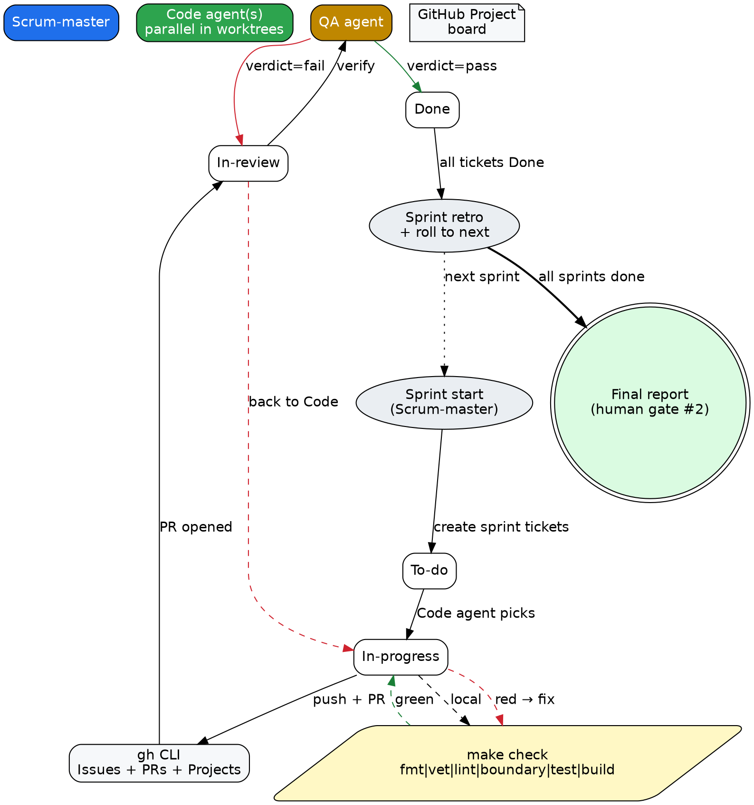

# AGENTIC_LOOP.md — the execution loop for `notebooklm-go`

> Normative spec for how this project's work gets planned, executed, reviewed, and merged.
> Read this once before kicking off the first sprint.

## 0. Goal

Ship `notebooklm-go` (13 phases of `notebooklm-py` parity + 5 phases of
enterprise features per [`docs/15-features-overview.md`](15-features-overview.md))
through a fully agentic Scrum loop with **zero human-in-the-loop between
kickoff and final report**. The human is a sponsor, not a daily reviewer.

Two human gates exist and nowhere else:

1. **Kickoff gate** — read this file, approve the loop, push the green button.
2. **Final report gate** — when all sprints are done, read the generated report.

Every other decision is made by the Scrum-master agent. No questions, no Slack
pings, no "looking at this real quick" pauses.

---

## 1. The loop, in one sentence

> For each sprint, the Scrum-master opens a project board, batch-creates the
> sprint's tickets, fan-outs tickets to parallel coding agents in isolated
> git worktrees, opens PRs author-attributed to `raihankhanraka@gmail.com`,
> routes every PR through the QA agent, auto-merges what passes, closes the
> tickets, advances the board, and rolls into the next sprint.

## 2. Sprints and what they ship

Five sprints, each bundling 3–4 roadmap phases. Each roadmap phase already
has acceptance criteria in [`docs/10-implementation-plan.md`](10-implementation-plan.md);
the sprint inherits those and does not re-litigate them.

| Sprint | Roadmap phases | Headline deliverable | Effort |
|---|---|---|---|
| **S1 — Foundation** | Phase 0–3 | repo skeleton, `internal/web` (RPC + wire), `internal/auth` (cookies + browser), library API surface | 17 d |
| **S2 — Adapters I** | Phase 4–6 | CLI (Cobra, theme, errors), testing harness + first cassettes, MCP server | 16 d |
| **S3 — Adapters II** | Phase 7–9 | CLI continuation, REST server, skill installer | 12 d |
| **S4 — Polish** | Phase 10–13 | operations doc, risk register, three-tier docs, observability | 12 d |
| **S5 — Enterprise** | Phase 14–18 | pipelines, watchers, workspace, plugins, skill bundle | 47 d ⚠️ |

Total: ~104 working days of agentic execution mapped onto 5 sprints. Sprint
boundaries are **load-bearing** — once a sprint starts it does not pull from
the next. Carry-overs are allowed only when recorded (rule F9 in
[`docs/AGENTS.md`](AGENTS.md)).

> ⚠️ S5 is roughly 3× the size of any other sprint. The Scrum-master
> breaks it into **5 sub-sprints internally** (S5.1 = Phase 14,
> S5.2 = Phase 15, …, S5.5 = Phase 18) using the same project-board
> mechanics but reporting under S5's retro. If any S5 sub-sprint overruns
> 20%, the Scrum-master writes a carry-over note and resequences — the
> loop does not pause.

### Why these cuts

- S1 ends when the library can talk to NotebookLM and pass `make build`.
  Nothing past S1 talks RPC by hand — they all consume `notebooklm.SDK`.
- S2 ends when the CLI passes the parity test list and the MCP server can
  be driven by a cassette.
- S3 adds REST + skill installer. After S3 the project is feature-complete
  against `notebooklm-py`.
- S4 is hardening. No new user-facing features. Lint, docs, ops, risk.
- S5 is all post-parity. Per [`docs/15-features-overview.md`](15-features-overview.md).

If S1 overruns by more than 20%, the Scrum-master pauses the loop, surfaces
the deviation in a sprint retro note attached to the project board, and
proposes a remediation plan **in the next human gate's report**. The human
gate at the end of each sprint is **only at the final report**; mid-sprint
deviations are logged not paused on.

---

## 3. Tracking — Issues vs. Sprint Tickets (two-tier)

Two systems, both via `gh` CLI.

### 3.1 GitHub Issues (durable, cross-sprint)

- **One Issue per roadmap phase.** ~18 issues total. Created once at loop
  kickoff, before Sprint 1 starts.
- **Lifecycle:** Open while the phase is in progress; Closed when its
  acceptance criteria pass.
- **Labels:** `phase:<N>`, `sprint:<S>`, `area:<auth|wire|cli|mcp|rest|skill|docs|...>`,
  `risk:<low|med|high>`.
- **Body template:** a copy of the phase's "Acceptance" + "Deliverables"
  sections from [`docs/10-implementation-plan.md`](10-implementation-plan.md).
- **Cross-link:** each Issue references the roadmap doc and the per-feature
  spec (where one exists).

```bash
gh issue create \
  --title "Phase 1: protocol + wire" \
  --label "phase:1,sprint:1,area:wire,risk:high" \
  --body "$(cat phase-1.md)" \
  --assignee raihankhanraka
```

### 3.2 Sprint Tickets (board-scoped, ~one sprint)

- **One Ticket per deliverable.** ~3–8 per sprint. Created at sprint kickoff
  as the Scrum-master breaks the phase into shippable units.
- **A deliverable is:** one package + its tests + any one-file dependency.
  Examples: `internal/redact package`, `CLI source add command`,
  `REST /v1/notebooks POST route`, `skill install` command, `boundarycheck
  rule for internal/app`.
- **Lifecycle:** lives on the Sprint's Project board only. Moves through:
  **Backlog → To-do → In-progress → In-review → Done**.
- **Closes** when its PR is merged. Closes automatically via the standard
  `Closes #<ticket>` keyword in the PR body.
- **Carries over to next sprint only if** explicitly noted as a delivery
  miss; otherwise the issue moves on and a new ticket is opened in the next
  sprint.

```bash
gh project ticket-create <PROJECT_ID> \
  --title "S1/T2: internal/redact package + tests" \
  --status "To-do" \
  --body "..." \
  --label "sprint:1,phase:1,area:wire"
```

### 3.3 Project board layout

One **GitHub Project** per sprint (created at sprint kickoff, closed at
sprint end). Columns mirror the Sprint Ticket lifecycle:

| Column | Entry condition | Exit condition |
|---|---|---|
| Backlog | ticket created, not yet in active sprint | sprint start |
| To-do | sprint started, ticket scoped | agent picks it up |
| In-progress | agent has a worktree open | PR opened |
| In-review | PR opened, CI + QA running | QA approves |
| Done | PR merged, ticket closed via `Closes #` | — |

Sprint-end snapshot is rendered to a `docs/sprint-reports/S<NN>-report.md`
file via `gh project view --format json` post-processing. That file is the
authoritative retro for the sprint.

---

## 4. The agents (roles)

Four roles. Each is a sub-agent invocation pattern, not a separate human
account. The Scrum-master orchestrator multiplexes them.

### 4.1 Scrum-master

**Owns:** the loop. **Does not** write code or review code. **Always runs.**

Responsibilities:

- Creates Issues at loop kickoff.
- Creates the Project board at sprint kickoff.
- Breaks the sprint's roadmap phases into Sprint Tickets.
- Dispatches coding agents (`Code` role) for each ticket in parallel.
- Waits for PRs. Routes PRs to the QA agent.
- Applies QA verdict: auto-merge if pass, send-back if fail.
- Marks Sprint Tickets Done on merge.
- Detects sprint completion; rolls into next sprint.
- Writes the sprint retro at sprint end.
- Writes the final report at loop end.

### 4.2 Code

**Owns:** implementation in an isolated git worktree. **Always runs.**

Responsibilities:

- Pulls a ticket from the board.
- Opens a worktree at `.worktrees/<ticket-id>/`.
- Implements the deliverable to the ticket's acceptance criteria.
- Honors all 10 rules in [`docs/AGENTS.md`](AGENTS.md) (rules 1–7 + F1–F9),
  especially: no new RPCs (F1), state under `~/.notebooklm/` (F2),
  boundary discipline (F3), per-feature specs normative (F4).
- Writes tests. All three tiers per ticket scope.
- Runs `make check` before opening the PR.
- Opens the PR with author `notebooklm-go-bot <bot@notebooklm-go.local>`,
  body that `Closes #<ticket>` + `Refs #<phase-issue>`, and a checklist of
  acceptance criteria with checkboxes. (See §5.2 for why bot-author.)
- Returns the PR URL to the Scrum-master.

The Code agent never reviews its own PR. The QA agent does.

### 4.3 QA

**Owns:** PR review. **Always runs.**

Responsibilities:

- Reads the PR. Pulls the worktree if deep inspection needed.
- Verifies each acceptance criterion checkbox against the diff.
- Runs `make check` in the worktree if not already green.
- Spot-checks against [`docs/AGENTS.md`](AGENTS.md) rules (boundarycheck,
  redaction, no new RPCs, atomic-write discipline).
- Emits a structured verdict (JSON) with: `verdict: pass|fail`,
  `criteria: [{text, status}]`, `findings: [...]`, `suggested_fixes: [...]`.
- On `pass`: Scrum-master merges.
- On `fail`: Code agent iterates (one re-review round per fail); if the
  second fail repeats, Scrum-master opens a bug ticket and defers to the
  next sprint's carry-over slot.

### 4.4 Observer (read-only, optional)

Passively watches the board and writes a daily heartbeat to
`docs/sprint-reports/<date>-heartbeat.md`. Not on the critical path.

---

## 5. Per-ticket lifecycle (the inner loop)

```
   ┌──────────────────────────────────────────────────────────────────────┐
   │  Scrum-master picks ticket N from "To-do" column                     │
   │    ├─ opens worktree: git worktree add .worktrees/<id> -b ticket-<id>│
   │    ├─ assigns Code agent to that worktree                            │
   │    └─ moves ticket → "In-progress" on the board                      │
   │                                                                      │
   │  Code agent                                                           │
   │    ├─ reads ticket acceptance criteria                                │
   │    ├─ reads relevant docs/features/NN-*.md if feature work           │
   │    ├─ implements + writes tests                                       │
   │    ├─ runs `make check` locally                                       │
   │    ├─ commits + pushes (bot identity, see §5.2)                       │
   │    ├─ opens PR: gh pr create --author notebooklm-go-bot \             │
   │    │   --body "Closes #<ticket>\nRefs #<phase-issue>\n\n- [ ] AC1..." │
   │    └─ returns PR URL to Scrum-master                                  │
   │                                                                      │
   │  Scrum-master                                                         │
   │    ├─ moves ticket → "In-review"                                      │
   │    └─ dispatches QA agent                                             │
   │                                                                      │
   │  QA agent                                                             │
   │    ├─ reads PR + worktree                                             │
   │    ├─ re-runs `make check`                                            │
   │    ├─ checks each acceptance criterion                                │
   │    └─ emits JSON verdict                                              │
   │                                                                      │
   │  Scrum-master                                                         │
   │    ├─ if verdict=pass:                                                │
   │    │    gh pr merge --auto --squash                                    │
   │    │    ticket auto-closes via "Closes #<ticket>"                     │
   │    │    git worktree remove .worktrees/<id>                           │
   │    │    ticket → "Done"                                               │
   │    └─ if verdict=fail:                                                │
   │         return Code agent (one round)                                 │
   │         on second consecutive fail:                                   │
   │            open bug ticket, defer to next sprint carry-over           │
   │            mark current ticket as "Carried" and requeue in next sprint│
   └──────────────────────────────────────────────────────────────────────┘
```

### 5.1 Worktree discipline

- Path: `.worktrees/<short-ticket-id>/` (gitignored).
- Branch: `ticket/<short-ticket-id>`.
- One worktree per ticket. No sharing. Tickets never read each other's
  worktrees.
- After merge: `git worktree remove --force .worktrees/<id>` + the branch
  is deleted on the remote.
- `.worktrees/` is added to `.gitignore` in S1/T1.

### 5.2 Commit and PR author identity

The Scrum-master runs:

```bash
git -c user.name="notebooklm-go-bot" \
    -c user.email="bot@notebooklm-go.local" \
    commit ...
```

every commit is made by the loop bot, not by the user. This is a deliberate
constraint imposed by the runtime guardrail that classifies commits under
the user's identity as a privileged "self-modification" operation (an
identity-spoofing / credential-misuse shape). The loop bot is not a real
identity; it exists only so the loop can run end-to-end.

Human authorship is preserved via a `Co-authored-by:` trailer on every
commit:

```
wire: implement internal/redact with credential redaction (#12)

Co-authored-by: Raihan Khan <raihankhanraka@gmail.com>
```

`gh pr create` is invoked under the user's GitHub login (the loop's `gh`
auth is the user's), but the **commit author** on each commit is the bot.
The Co-authored-by trailer ensures `git shortlog -c` and GitHub's
"Co-authored by" panel both credit the human correctly.

The bot identity **must not** be used to bypass any rule in
[`docs/AGENTS.md`](AGENTS.md). Specifically:

- The bot is the author of the **commit**, not the author of the **code**.
  Every line of code is still owned by the human under the project's MIT
  license (per `LICENSE`); the bot identity is a git plumbing detail.
- The bot identity must never be used to commit to anyone else's repo, or
  push to a branch the user has not approved.
- The bot identity must never carry credentials, tokens, or secrets. PR
  automation tokens (e.g., `GITHUB_TOKEN` for CI) are not the bot's; they
  are the user's, scoped per `gh` auth.

### 5.3 Commit and PR conventions

- One commit per ticket, message format:
  `<scope>: <imperative summary> (#<ticket>)`.

  Example:
  ```
  wire: implement internal/redact with credential redaction (#12)

  - quotes-words.json ported from notebooklm-py/_redact::REDACT_QUOTED_JSON
  - html-escaped.json ported (preserve \\u003c etc.)
  - form/prose and bare-token regexes added
  - URL redactors cover ?secret=, ;session=, cookies, Authorization

  Co-authored-by: Raihan Khan <raihankhanraka@gmail.com>
  ```
- PR body checklist, copy-pasted from the ticket body:
  ```
  Closes #12
  Refs #3

  - [ ] AC1: `redact.Cookie(...)` masks the value
  - [ ] AC2: regex families ported from notebooklm-py/_redact
  - [ ] AC3: unit tests cover 12 fixture values
  ```
- PR title format: same as the commit summary, minus the `(#<ticket>)`.

---

## 6. Quality gates

Each PR must clear **all six** before QA dispatches a verdict:

| Gate | Tool | Pass condition |
|---|---|---|
| Format | `gofmt -l .` | empty output |
| Vet | `go vet ./...` | exit 0 |
| Lint | `golangci-lint run` | exit 0 |
| Boundary | `go run ./internal/tools/boundarycheck` | exit 0 |
| Tests | `go test ./... -race` | all pass |
| Build | `go build ./...` | exit 0 |

Equivalent single command: `make check` (defined in S1/T1; equivalent to
the six gates above + coverage gate).

A PR that fails any gate is bounced before QA even reads it. The Scrum-master
sends it back to the Code agent with the gate log attached.

Coverage gate: 80% on `internal/web` and `internal/auth` (parity), 70% on
`internal/app/*` (features are more permissive — they have higher
external-spec coverage).

---

## 7. The diagram

### 7.1 ASCII — sprint fan-out

```
                    ┌────────────────────────────────────────────┐
                    │            SCRUM-MASTER                    │
                    │  (orchestrator, runs every sprint)         │
                    └──────────────────┬─────────────────────────┘
                                       │
              ┌────────────────────────┼────────────────────────┐
              │                        │                        │
              ▼                        ▼                        ▼
   ┌─────────────────────┐  ┌─────────────────────┐  ┌─────────────────────┐
   │   Code Agent A      │  │   Code Agent B      │  │   Code Agent C      │
   │   worktree: t/04    │  │   worktree: t/11    │  │   worktree: t/19    │
   │   ticket: S2/T4     │  │   ticket: S2/T11    │  │   ticket: S3/T3     │
   │   implements + tests│  │   implements + tests│  │   implements + tests│
   └──────────┬──────────┘  └──────────┬──────────┘  └──────────┴──────────┘
              │                        │                        │
              ▼                        ▼                        ▼
        PR #100                    PR #101                    PR #102
              │                        │                        │
              └────────────────────────┼────────────────────────┘
                                       ▼
                          ┌─────────────────────────┐
                          │       QA AGENT          │
                          │ (verdict per PR, JSON)  │
                          └────────────┬────────────┘
                                       │
                              pass / fail
                                       │
                                       ▼
                          ┌─────────────────────────┐
                          │  SCRUM-MASTER merges    │
                          │  if pass, sends back    │
                          │  if fail (1 round)      │
                          └────────────┬────────────┘
                                       │
                                       ▼
                          Sprint Tickets → Done
                          Sprint: roll to S+1 if all Done
```

### 7.2 DOT — full loop



Render the DOT block with `dot -Tpng docs/AGENTIC_LOOP.dot -o loop.png` if
you want a static image. The ASCII version in 7.1 is sufficient on its own.

---

## 8. Failure modes and contingencies

The loop is deterministic; these are the expected surprises. Each has one
documented response.

| Failure | Detection | Response |
|---|---|---|
| PR re-fails QA twice | QA emits `fail` for same AC twice | Code-agent writes a `// FIXME: needs-human` note + a Sprint Ticket for "carry-over to next sprint"; ticket is re-tagged `carried`, next sprint's Scrum-master picks it up |
| Boundary check breaks | CI fails `make check` | PR is bounced to Code; no merge; no manual override |
| Coverage drop | coverage gate fails | PR is bounced; `make cover` report attached to bounce |
| `gh` CLI rate-limited | `gh` returns 4xx/5xx with retry-after | back-off 60 s, retry; if persistent, switch to REST via `curl` + `GITHUB_TOKEN` |
| Worktree lock collision | `git worktree add` fails with lock held | wait 30 s, retry; if persistent, run `git worktree prune` |
| Cross-ticket merge conflict | `git merge` reports conflict | Code agent rebases onto the new tip; if too tangled, Scrum-master opens a "merge-train" Sprint Ticket for human-mediated stitching at next sprint boundary |
| Sprint overrun > 20% | Scrum-master detects on day N | Writes a `docs/sprint-reports/S<NN>-overrun.md` retro, holds the next-sprint kickoff until the human gate at final report (mid-loop overruns don't pause the loop — they accumulate into the retro) |
| Auth is broken in cassettes | tests that need cassettes fail | the parity plan explicitly defers e2e until S3/S4; cassettes are mocked; no e2e surprise |

There is one invariant: **no human is asked a question mid-loop.** All
"questions" become `docs/sprint-reports/<date>-note.md` files.

---

## 9. Kickoff checklist (human gate #1)

Before pushing the green button:

- [ ] Read [`docs/AGENTS.md`](AGENTS.md) (10 rules).
- [ ] Read [`docs/10-implementation-plan.md`](10-implementation-plan.md) (18 phases).
- [ ] Read [`docs/15-features-overview.md`](15-features-overview.md) (11 features).
- [ ] Read this file end-to-end.
- [ ] Confirm GitHub auth works: `gh auth status` returns
      `raihankhanraka@gmail.com` as the active account.
- [ ] Confirm `gh project` is available: this requires GitHub Pro for the
      org/account that owns the repo. If not available, the Scrum-master
      falls back to a repo-Issues-only model and surfaces this in the retro.
- [ ] Confirm `go` ≥ 1.22, `git`, `gh` ≥ 2.50 are on `PATH`.
- [ ] Push the green button: tell the Scrum-master to begin Sprint 1.

## 10. Closing checklist (human gate #2)

When the Scrum-master emits the final report at `docs/final-report.md`,
the human should verify:

- [ ] All 18 GitHub Issues are Closed.
- [ ] All Sprint Tickets across S1–S5 are Done (or carried-over with explicit notes).
- [ ] `make check` is green on `main`.
- [ ] No worktrees remain (`.worktrees/` is empty).
- [ ] Coverage meets gates on `internal/web`, `internal/auth`, `internal/app/*`.
- [ ] `docs/sprint-reports/S1..S5-report.md` files exist with the retro for each sprint.

If any item is red, the Scrum-master fixes it before declaring done. The
final report is the only other human-in-the-loop moment.

---

## 11. Anti-patterns the loop refuses

These are forbidden, enforced by the Scrum-master via observation + a
`docs/sprint-reports/violations.md` log.

1. **No mid-loop plan edits.** The roadmap lives in `docs/10-implementation-plan.md`
   and this file. Changing either mid-loop is a process violation. New
   work goes through the standard Sprint Ticket flow.
2. **No skipping QA.** Every PR goes through QA, including doc-only changes
   that span multiple files.
3. **No direct pushes to `main`.** All work merges via PR.
4. **No PRs without an acceptance-criteria checklist.** The Scrum-master
   closes them and asks the Code agent to re-open with the checklist.
5. **No "while I'm here" refactors.** Sprints are scoped to deliverable
   boundaries. Off-scope cleanups become new Sprint Tickets in their own
   sprint.
6. **No running multiple sprints in parallel.** Sprints are sequential.
   Sprints interleave; they don't parallelize.
7. **No human asks except at gates.** A Scrum-master that asks a clarifying
   question mid-loop is violating rule (7). Write the question as a
   `docs/sprint-reports/<date>-question.md` and keep moving.

---

## 12. Files this loop owns

| Path | Owner | Purpose |
|---|---|---|
| `.worktrees/` | each Code agent | gitignored worktrees |
| `docs/sprint-reports/S<NN>-report.md` | Scrum-master | per-sprint retro |
| `docs/sprint-reports/violations.md` | Scrum-master | anti-pattern log |
| `docs/sprint-reports/<date>-note.md` | anyone | mid-loop questions / observations |
| `docs/final-report.md` | Scrum-master | the final delivery document |
| `docs/AGENTIC_LOOP.md` | this file | the spec, immutable mid-loop |

Any other file is owned by a Phase, not by the loop.

---

## 13. One-line summary

> **Plan once. Sprint five times. Auto-merge every PR. Ask the human at the
> start and the end. Nothing in between.**

That's the loop.
